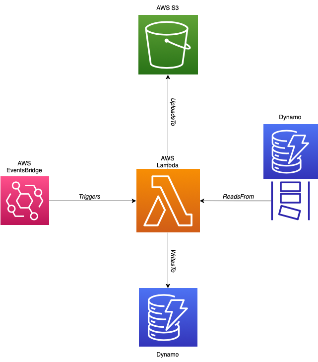

# Serverless projects.

## Will use this repo for any serverless projects I create while learning AWS.

## Auditor
This module contains the code and infrastructure for a lambda function that runs
on a schedule. Everytime it is invoked it creates a CSV audit of the operations performed on 
a DynamoDB table, since the last time the function ran and uploads to S3. 
It uses DynamoDB streams to capture the changes made to the DB. Since DynamoDB streams
stores changes for 1 day. This lambda should be run on a schedule that occurs at least
once a day.

### Code

The code is written in scala and built with SBT. Commands:

`sbt compile` - Compile the code

`sbt test` - Run the unit tests

`sbt assembly` - Package application into an uber jar in the auditor/target/scala-2.13 directory.

### Infrastructure

The infrastructure for the lambda can be created with the Terraform module provided in the 
auditor/infra directory.

**Required Arguments:**

| Argument          | Description                                                                                            |
|-------------------|--------------------------------------------------------------------------------------------------------|
 | dynamo-policy-arn | The ARN of the IAM policy to attach to the lambda that allows the lambda to access the DynamoDb table. |
 | bucket-name       | The name of the S3 bucket that the file will be created in.                                            |
 | table-name        | The dynamo DB table to audit.                                                                          |

**Optional Arguments:**

| Argument            | Description                                                                                          | Default                                                             |
|---------------------|------------------------------------------------------------------------------------------------------|---------------------------------------------------------------------|
| csv_filename_prefix | The filename of the CSV audit file. The filename will be appended with the current date time in UTC. | The default is the table name of the dynamo db table being audited. |
| schedule            | The schedule to trigger the lambda.                                                                  | cron(0, 0, *, *, ?, *)                                              | 

Below is an image of the infrastructure created by the auditor (note the dynamo table with the stream is provided by the user):

### Dummy Data

This project provides a module to create dummy data in DynamoDb. It can be used together with the auditor lambda to create dummy data and audit in S3.
There is a docker compose file provided in the root of this project that can create and run both lambdas.
Make sure you have your AWS credentials in your ~/.aws/credentials file and set as default. The docker containers will use these
credentials to create the necessary infrastructure.

